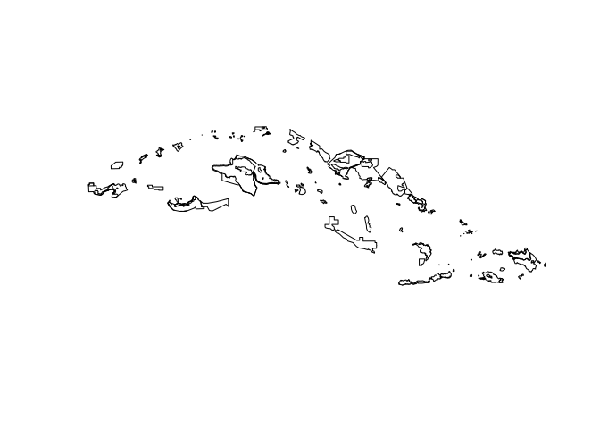
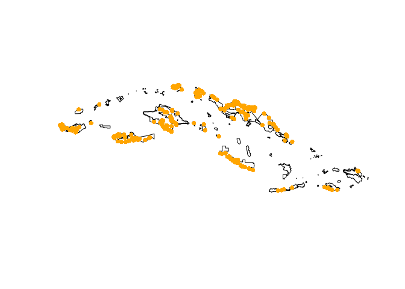

mpatools
================

Tools for working with [Marine Protected
Areas](https://www.iucn.org/theme/protected-areas/our-work/quality-and-effectiveness/world-database-protected-areas-wdpa)
to compute species diversity metrics using [OBIS](https://obis.org/)
data.

# Requirements

-   [R v4+](https://www.r-project.org/)

-   [rlang](https://CRAN.R-project.org/package=rlang)

-   [dplyr](https://CRAN.R-project.org/package=dplyr)

-   [readr](https://CRAN.R-project.org/package=readr)

-   [rappsdir](https://CRAN.R-project.org/package=rappsdir)

-   [wdpar](https://CRAN.R-project.org/package=wdpar)

-   [sf](https://CRAN.R-project.org/package=sf)

-   [vegan](https://CRAN.R-project.org/package=vegan)

-   [robis](https://cran.r-project.org/web/packages/robis/index.html)

# Installation

    remotes::install_github("BigelowLab/mpatools")

# Usage

## Polygons for MPAs

We use the [wdpar](https://CRAN.R-project.org/package=wdpar) R package
to fetch MPAs by country (or ‘global’ for the complete dataset.) By
default, we store the files you download in the path returned by
`rappdirs::user_data_dir("wdpar")` in
[GeoPackage](https://www.geopackage.org/) format. Once you have
downloaded a dataset you can simply read the file from disk using
`read_mpa("name")`. Below, we use the `list_mpa()` function to determine
if we already have the Cuba dataset.

``` r
library(rappdirs)
library(sf)
library(mpatools)
if ("Cuba" %in% list_mpa()){
  mpa <- read_mpa(name = "Cuba")
} else {
  mpa <- fetch_mpa(name = 'Cuba')
}
# 
plot(sf::st_geometry(mpa))
```

<!-- -->

## OBIS occurrence data

Once you have MPA polygons in hand, it is easy to request OBIS records
that fall within the polygons. We use the
[robis](https://cran.r-project.org/web/packages/robis/index.html) R
package to fetch occurrence data. By default we store files you downlaod
in the path returned by `rappdirs::user_data_dir("robis")` in
[GeoPackage](https://www.geopackage.org/). Once you have downloaded
format you can simply read the file from disk using `read_obis()`.

``` r
if ("Cuba" %in% list_obis()){
  obis <- read_obis(name = "Cuba", form = "sf")
} else {
  obis <- fetch_obis_country(name = 'Cuba')
}
head(obis)
```

    ## Simple feature collection with 6 features and 164 fields
    ## Geometry type: POINT
    ## Dimension:     XY
    ## Bounding box:  xmin: -77.45 ymin: 19.867 xmax: -75.37 ymax: 19.96056
    ## Geodetic CRS:  WGS 84
    ## # A tibble: 6 × 165
    ##   date_year scientificNameID      scientificName   superfamilyid individualCount
    ##       <int> <chr>                 <chr>                    <int>           <dbl>
    ## 1      1963 urn:lsid:marinespeci… Balaenoptera br…        148724               1
    ## 2      1957 urn:lsid:marinespeci… Parapagurion im…        155727               2
    ## 3      1930 urn:lsid:marinespeci… Tectarius anton…         14766               1
    ## 4      1930 urn:lsid:marinespeci… Nodilittorina            14766               2
    ## 5      1974 urn:lsid:marinespeci… Ziphius caviros…        148723               1
    ## 6      2018 urn:lsid:marinespeci… Reinhardorhynch…            NA              NA
    ## # … with 160 more variables: associatedReferences <chr>, dropped <lgl>,
    ## #   aphiaID <int>, subclassid <int>, type <chr>, taxonRemarks <chr>,
    ## #   phylumid <int>, familyid <int>, catalogNumber <chr>,
    ## #   occurrenceStatus <chr>, basisOfRecord <chr>, terrestrial <lgl>,
    ## #   superclass <chr>, modified <chr>, id <chr>, order <chr>,
    ## #   recordNumber <chr>, georeferencedDate <chr>, superclassid <int>,
    ## #   verbatimEventDate <chr>, infraorderid <int>, dataset_id <chr>, …

We actually find occurrences that fall within the convex hull of a set
of polygons, but you can enforce a stricter policy using the `policy`
argument for `fetch_obis()`. See `?fetch_obis`.

``` r
plot(sf::st_geometry(mpa))
plot(sf::st_geometry(obis), col = 'orange', pch = 16, add = TRUE)
```

<!-- -->

## Where are MPAs and OBIS data stored?

We use [rappsdir](https://CRAN.R-project.org/package=rappsdir) R package
to manage the stirage location. We store data here
`rappdirs::user_data_dir("wdpar")` and here
`rappdirs::user_data_dir("robis")`. This is a very effective way to
store data **per user**. But if you want to store data at a system-wide
location you can do that using the ubiquitous `path` argument.
